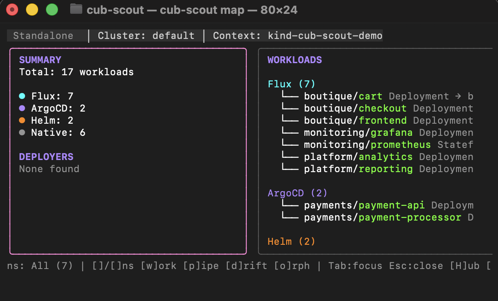

# cub-scout -- explore and map GitOps clusters

Cub-scout is an open source cluster explorer which is designed to work with existing k8s/gitops clusters as a 'standalone' (read only) tool.  You can also run cub-scout with more features in ['connected' mode](#connecting-cub-scout-confighub), using your (free!) account on [ConfigHub](https://confighub.com).  Or you can [integrate its behaviour](https://github.com/confighub/cub-scout/blob/main/docs/reference/gsf-schema.md) into your own favourite tool.

NOTE: experimental project.  Please send feedback by [opening an issue](https://github.com/confighub/cub-scout/issues) or joining [Discord](https://discord.gg/confighub).  

**Demystify GitOps. See what's really happening in your cluster.**

GitOps is powerful but can be a opaque at times. Where did this Deployment come from? Why isn't my change applying? Is this managed by Git or was it kubectl'd? cub-scout makes the invisible visible.

```bash
brew install confighub/tap/cub-scout
cub-scout map
```

### Quickstart (2 minutes)

1. **Prerequisites:** kubectl access to a cluster (`kubectl get pods` works)
2. **First command:** `cub-scout map` — launches interactive TUI
3. **Press `?`** for keyboard shortcuts
4. **Try:** `cub-scout trace deploy/<name> -n <namespace>` on any deployment

---

**Ownership at a glance:**


**Press `w` to see all workloads grouped by owner:**



Press `T` to trace any resource. Press `4` for deep-dive. Press `?` for help.

---

## The Problem

GitOps tools are powerful but can hide complexity behind layers of abstraction.

**What's obscure:**
- A Deployment exists, but where did it come from? (Kustomization? HelmRelease? kubectl?)
- A change isn't applying, but why? (Source not ready? Reconciliation stuck? Wrong path?)
- Resources exist with no owner — who created them and when?
- Dependencies between apps are invisible until something breaks

**What you end up doing:**
- `kubectl get kustomization -A` + `kubectl get helmrelease -A` + `kubectl get application -A`
- Manually checking labels to figure out ownership
- Tribal knowledge: "Oh, that's managed by the platform team's Flux setup"

cub-scout shows you the whole picture in seconds.

---

## The Solution

cub-scout shows you the whole picture in one view.

### Status Dashboard

```bash
cub-scout map status
```

```
  ✓ ALL HEALTHY   prod-east

  Deployers  5/5
  Workloads  47/47

  OWNERSHIP
  ────────────────────────────────────────────────
  Flux(28) ArgoCD(12) Helm(5) Native(2)
  ██████████████░░░░░░
```

When things go wrong:

```
  🔥 3 FAILURE(S)   prod-east

  Deployers  3/5
  Workloads  44/47

  PROBLEMS
  ────────────────────────────────────────────────
  ✗ HelmRelease/redis-cache      SourceNotReady
  ✗ Application/payment-api      OutOfSync
  ⏸ Kustomization/monitoring     suspended
```

---

### Trace Any Resource to Git

**One command for Flux, ArgoCD, or Helm.** You don't need to know which tool manages a resource.

```bash
cub-scout trace deploy/payment-api -n prod
```

Auto-detects the GitOps tool and shows the full chain: Git repo → Deployer → Workload → Pod

```
┌─────────────────────────────────────────────────────────────────────┐
│  TRACE: Deployment/payment-api                                      │
├─────────────────────────────────────────────────────────────────────┤
│                                                                     │
│  🟢 ✓ GitRepository/platform-config                                 │
│      │ URL: git@github.com:acme/platform-config.git                 │
│      │ Revision: main@sha1:abc123f                                  │
│      │ Status: Artifact is up to date                               │
│      │                                                              │
│      └─▶ 🟢 ✓ Kustomization/apps-payment                            │
│              │ Path: ./clusters/prod/apps/payment                   │
│              │ Status: Applied revision main@sha1:abc123f           │
│              │                                                      │
│              └─▶ 🟢 ✓ Deployment/payment-api                        │
│                      │ Namespace: prod                              │
│                      │ Status: 3/3 ready                            │
│                      │                                              │
│                      └─▶ ReplicaSet/payment-api-7d4b8c              │
│                          ├── Pod/payment-api-7d4b8c-abc12 ✓ Running │
│                          ├── Pod/payment-api-7d4b8c-def34 ✓ Running │
│                          └── Pod/payment-api-7d4b8c-xyz99 ✓ Running │
│                                                                     │
├─────────────────────────────────────────────────────────────────────┤
│ 🟢 ✓ All levels in sync. Managed by Flux.                           │
└─────────────────────────────────────────────────────────────────────┘
```

**Show deployment history:**

```bash
cub-scout trace deploy/payment-api -n prod --history
```

```
History:
  2026-01-28 10:00  main@sha1:abc123f    deployed    auto-sync
  2026-01-27 14:30  main@sha1:def456a    deployed    manual sync by alice@acme.com
  2026-01-25 09:15  main@sha1:789ghib    deployed    auto-sync
```

History data is fetched from each tool's native storage: ArgoCD `status.history`, Flux `status.history`, Helm release secrets.

---

### Tree Command — Multiple Hierarchy Views

```bash
cub-scout tree
```

**Runtime Hierarchy** — Deployment → ReplicaSet → Pod:

```
RUNTIME HIERARCHY (47 Deployments)
════════════════════════════════════════════════════════════════════
├── boutique/cart [Flux] 2/2 ready
│   └── ReplicaSet cart-86f68db776 [2/2]
│       ├── Pod cart-86f68db776-hzqgf  ✓ Running  10.244.0.15
│       └── Pod cart-86f68db776-mp8kz  ✓ Running  10.244.0.16
├── boutique/checkout [Flux] 1/1 ready
│   └── ReplicaSet checkout-5d8f9c7b4 [1/1]
│       └── Pod checkout-5d8f9c7b4-abc12  ✓ Running  10.244.0.17
├── monitoring/prometheus [Helm] 1/1 ready
│   └── ReplicaSet prometheus-7d4b8c [1/1]
│       └── Pod prometheus-7d4b8c-xyz99  ✓ Running  10.244.0.18
└── temp-test/debug-nginx [Native] 1/1 ready
    └── ReplicaSet debug-nginx-6c5d7b [1/1]
        └── Pod debug-nginx-6c5d7b-def34  ⚠ Pending  (no node)

────────────────────────────────────────────────────────────────────
Summary: 47 Deployments │ 189 Pods │ 186 Running │ 3 Pending
```

```bash
cub-scout tree ownership
```

**Ownership Hierarchy** — Resources grouped by owner:

```
OWNERSHIP HIERARCHY
════════════════════════════════════════════════════════════════════
Flux (28 resources)
├── boutique/cart             Deployment  ✓ 2/2 ready
├── boutique/checkout         Deployment  ✓ 1/1 ready
├── boutique/frontend         Deployment  ✓ 3/3 ready
├── ingress/nginx-ingress     Deployment  ✓ 2/2 ready
└── ... (24 more)

ArgoCD (12 resources)
├── cert-manager/cert-manager   Deployment  ✓ 1/1 ready
├── argocd/argocd-server        Deployment  ✓ 1/1 ready
└── ... (10 more)

Helm (5 resources)
├── monitoring/prometheus       StatefulSet ✓ 1/1 ready
├── monitoring/grafana          Deployment  ✓ 1/1 ready
└── ... (3 more)

Native (2 resources)  ⚠ ORPHANS
├── temp-test/debug-nginx       Deployment  ✓ 1/1 ready
└── kube-system/coredns         Deployment  ✓ 2/2 ready

────────────────────────────────────────────────────────────────────
Ownership: Flux 60% │ ArgoCD 26% │ Helm 10% │ Native 4%
```

```bash
cub-scout tree suggest
```

**Suggested Organization** — Hub/AppSpace recommendation:

```
HUB/APPSPACE SUGGESTION
════════════════════════════════════════════════════════════════════

Detected pattern: D2 (Control Plane style)
  └── clusters/prod, clusters/staging structure

Suggested Hub/AppSpace organization:

  Hub: acme-platform
  ├── Space: boutique-prod
  │   ├── Unit: cart          (Deployment boutique/cart)
  │   ├── Unit: checkout      (Deployment boutique/checkout)
  │   ├── Unit: frontend      (Deployment boutique/frontend)
  │   └── Unit: payment-api   (Deployment boutique/payment-api)
  │
  ├── Space: boutique-staging
  │   └── (clone from boutique-prod with staging values)
  │
  └── Space: platform
      ├── Unit: nginx-ingress   (Deployment ingress/nginx)
      ├── Unit: cert-manager    (Deployment cert-manager/cert-manager)
      └── Unit: monitoring      (StatefulSet monitoring/prometheus)

────────────────────────────────────────────────────────────────────
Next steps:
  1. Review the suggested structure above
  2. Import workloads: cub-scout import -n boutique
  3. View in ConfigHub: cub unit tree --space boutique-prod
```

---

### Discover and Health (Scout-Style Commands)

```bash
cub-scout discover
```

```
WORKLOADS BY OWNER
════════════════════════════════════════════════════════════════════

STATUS  NAMESPACE       NAME              OWNER      MANAGED-BY
✓       boutique        cart              Flux       Kustomization/apps
✓       boutique        checkout          Flux       Kustomization/apps
✓       boutique        frontend          Flux       Kustomization/apps
✓       monitoring      prometheus        Helm       Release/kube-prometheus
✓       monitoring      grafana           Helm       Release/kube-prometheus
✓       cert-manager    cert-manager      ArgoCD     Application/cert-manager
⚠       temp-test       debug-nginx       Native     — (orphan)

────────────────────────────────────────────────────────────────────
Found: 47 workloads │ Flux(28) ArgoCD(12) Helm(5) Native(2)
```

```bash
cub-scout health
```

```
CLUSTER HEALTH CHECK
════════════════════════════════════════════════════════════════════

DEPLOYER ISSUES
────────────────────────────────────────────────────────────────────
  ✗ HelmRelease/redis-cache      SourceNotReady
    Message: failed to fetch Helm chart: connection refused
    Last attempt: 5 minutes ago

  ⏸ Kustomization/monitoring     suspended
    Suspended since: 2026-01-20T10:30:00Z
    Reason: Manual pause for maintenance

WORKLOAD ISSUES
────────────────────────────────────────────────────────────────────
  ✗ temp-test/debug-nginx        0/1 pods ready
    Reason: ImagePullBackOff
    Image: nginx:nonexistent

────────────────────────────────────────────────────────────────────
Summary: 2 deployer issues │ 1 workload issue │ 1 suspended
```

---

### Scan for Configuration Issues

```bash
cub-scout scan
```

```
CONFIG RISK SCAN: prod-east
════════════════════════════════════════════════════════════════════

CRITICAL (1)
────────────────────────────────────────────────────────────────────
  [CCVE-2025-0027] Grafana sidecar namespace whitespace error
    Resource: monitoring/ConfigMap/grafana-sidecar
    Impact:   Dashboard injection fails silently
    Fix:      Remove spaces: NAMESPACE="monitoring,grafana"
    Ref:      FluxCon 2025 — BIGBANK 3-day outage

WARNING (2)
────────────────────────────────────────────────────────────────────
  [CCVE-2025-0043] Thanos sidecar not uploading to object storage
    Resource: monitoring/StatefulSet/prometheus
    Fix:      Check objstore.yml bucket configuration

  [CCVE-2025-0066] SSL redirect blocking ACME HTTP-01 challenge
    Resource: ingress/Ingress/api-gateway
    Fix:      Add: kubernetes.io/ingress.allow-http: "true"

INFO (1)
────────────────────────────────────────────────────────────────────
  [CCVE-2025-0084] PodDisruptionBudget allows zero available
    Resource: cache/PodDisruptionBudget/redis-pdb
    Fix:      Set minAvailable to at least 1

════════════════════════════════════════════════════════════════════
Summary: 1 CRITICAL │ 2 WARNING │ 1 INFO
Scanned: 47 resources │ Patterns: 46 active (4,500+ reference)
```

---

## Quick Commands

| Command | What You Get |
|---------|--------------|
| `cub-scout map` | Interactive TUI - press `?` for help |
| `cub-scout discover` | Find workloads by owner (scout-style alias) |
| `cub-scout tree` | Hierarchical views (runtime, git, config) |
| `cub-scout tree suggest` | Suggested Hub/AppSpace organization |
| `cub-scout trace deploy/x -n y` | Full ownership chain to Git source |
| `cub-scout trace deploy/x -n y --history` | Deployment history (who deployed what, when) |
| `cub-scout health` | Check for issues (scout-style alias) |
| `cub-scout scan` | Configuration risk patterns (46 patterns) |
| `cub-scout snapshot --relations` | Export state with dependency graph (GSF format) |

### Tree Views

| View | Shows |
|------|-------|
| `cub-scout tree runtime` | Deployment → ReplicaSet → Pod hierarchies |
| `cub-scout tree ownership` | Resources grouped by GitOps owner |
| `cub-scout tree git` | Git source structure (repos, paths) |
| `cub-scout tree patterns` | Detected GitOps patterns (D2, Arnie, etc.) |
| `cub-scout tree config --space X` | ConfigHub Unit relationships (wraps `cub unit tree`) |
| `cub-scout tree suggest` | Recommended Hub/AppSpace structure |

---

## Keyboard Shortcuts

| Key | View |
|-----|------|
| `s` | Status dashboard |
| `w` | Workloads by owner |
| `o` | Orphans (unmanaged resources) |
| `4` | Deep-dive (resource trees) |
| `5` | App hierarchy (inferred Units) |
| `T` | Trace selected resource |
| `/` | Search |
| `?` | Help |
| `q` | Quit |

---

## Ownership Detection

| Owner | How Detected |
|-------|--------------|
| **Flux** | `kustomize.toolkit.fluxcd.io/*` or `helm.toolkit.fluxcd.io/*` labels |
| **ArgoCD** | `argocd.argoproj.io/instance` label |
| **Helm** | `app.kubernetes.io/managed-by: Helm` (standalone, not Flux-managed) |
| **Crossplane** | `crossplane.io/claim-name` label or `*.crossplane.io` owner refs *(experimental)* |
| **ConfigHub** | `confighub.com/UnitSlug` label |
| **Native** | None of the above (kubectl-applied) |

**Flux sources supported:** GitRepository, OCIRepository, HelmRepository, Bucket

**ArgoCD sources supported:** Git, OCI, Helm charts

**Helm tracing:** For standalone Helm releases (not managed by Flux HelmRelease), cub-scout reads release metadata directly from Kubernetes secrets.

**Crossplane support (experimental):** cub-scout detects Crossplane-managed resources via claim labels, composite references, and owner references to `*.crossplane.io` or `*.upbound.io` API groups. Useful for platform teams managing cloud infrastructure alongside GitOps workloads. See [cross-owner-demo](examples/demos/cross-owner-demo.yaml) for a realistic scenario.

### ConfigHub OCI Registry Support

cub-scout automatically detects and traces resources deployed from ConfigHub acting as an OCI registry:

**ConfigHub OCI URL format:** `oci://oci.{instance}/target/{space}/{target}`

**Example trace output:**
```
  ✓ ConfigHub OCI/prod/us-west
    │ Space: prod
    │ Target: us-west
    │ Registry: oci.api.confighub.com
    │ Revision: latest@sha1:abc123
    │
    └─▶ ✓ Application/frontend-app
        Status: Synced / Healthy
```

Works with both Flux OCIRepository and ArgoCD Applications pulling from ConfigHub OCI.

---

## See It at Scale

For a realistic demo with 50+ resources, see [docs/getting-started/scale-demo.md](docs/getting-started/scale-demo.md).

```bash
# Deploy the official Flux reference architecture
flux bootstrap github --owner=you --repository=fleet-infra --path=clusters/staging

# Explore with cub-scout
cub-scout map
```

---

## Install

### Homebrew (macOS/Linux)

```bash
brew install confighub/tap/cub-scout
```

### From Source

```bash
git clone https://github.com/confighub/cub-scout.git
cd cub-scout
go build ./cmd/cub-scout
./cub-scout version
```

### Docker

```bash
docker run --rm --network=host \
  -v ~/.kube:/home/nonroot/.kube \
  ghcr.io/confighub/cub-scout map list
```

---

## How It Works

cub-scout uses **deterministic label detection** — no AI, no magic:

1. Connect to your cluster via kubectl context
2. List resources across all namespaces
3. Examine labels and annotations on each resource
4. Match against known ownership patterns (Flux, Argo, Helm, etc.)
5. Display results

**Read-only by default.** We only use `Get`, `List`, `Watch` — never `Create`, `Update`, `Delete`. See [SECURITY.md](SECURITY.md) for details.

---

## Design Principles

**Wrap, don't reinvent.** cub-scout builds on existing tools rather than replacing them:

| Principle | What It Means |
|-----------|---------------|
| **Use kubectl** | All cluster access goes through your existing kubeconfig |
| **Use cub CLI** | Fleet queries use ConfigHub's `cub` CLI, not a parallel API |
| **Parse, don't guess** | Ownership comes from actual labels, not heuristics |
| **Complement GitOps** | Works alongside Flux, Argo, Helm — doesn't compete |

**Why this matters:** Your existing tools, RBAC, and audit trails all still work. cub-scout is a lens, not a replacement.

> **🧪 Built with AI assistance:** This project was developed with AI pair programming. It's read-only by default, deterministic (no ML inference), and CI-tested. We'd love to hear what you learn using it — [open an issue](https://github.com/confighub/cub-scout/issues) or join [Discord](https://discord.gg/confighub).

---

## Connecting cub-scout ConfigHub

cub-scout is an experimental open-source cluster explorer which is designed to work with existing k8s clusters as a 'standalone' (read only) tool.  Or, if you have signed up, we recommended running cub-scout connected to [ConfigHub](https://confighub.com).

| Feature | Standalone | Connected |
|---------|:----------:|:---------:|
| `map` — Interactive TUI | ✓ | ✓ |
| `trace` — Ownership chains | ✓ | ✓ |
| `tree` — Hierarchy views | ✓ | ✓ |
| `scan` — Risk patterns | ✓ | ✓ |
| `discover` / `health` | ✓ | ✓ |
| `snapshot` — Export state (GSF) | ✓ | ✓ |
| `import` — Send to ConfigHub | — | ✓ |
| `fleet` — Multi-cluster queries | — | ✓ |
| DRY↔WET↔LIVE compare | — | ✓ |
| Revision history | — | ✓ |
| Team collaboration | — | ✓ |

**Standalone:** No signup, works forever. Read-only cluster exploration features.

**Connected:** Run `cub auth login` to link to ConfigHub to access more features and import apps.

### How to Connect

To use connected mode features, authenticate your machine with the ConfigHub CLI:

```bash
# Install the ConfigHub CLI (if not already installed)
brew install confighub/tap/cub

# Authenticate (opens browser for login)
cub auth login
```

Once authenticated, cub-scout automatically operates in **connected mode**:

- **Fleet visibility:** Query resources across all clusters your organization has connected to ConfigHub
- **Import workloads:** Send discovered resources to ConfigHub for tracking and collaboration
- **Worker access:** Read from any cluster that ConfigHub is connected to via a [Bridge Worker](https://docs.confighub.com/workers), even without direct kubectl access

Your authentication is stored locally and shared between `cub` and `cub-scout`.

### Verify Connection

Use `cub-scout status` to verify your connection status:

```bash
$ ./cub-scout status
ConfigHub:  ● Connected (alexis@confighub.com)
Cluster:    prod-east
Context:    eks-prod-east
Worker:     ● bridge-prod (connected)
```

JSON output is available for scripting:

```bash
$ ./cub-scout status --json
{
  "mode": "connected",
  "email": "alexis@confighub.com",
  "cluster_name": "prod-east",
  "context": "eks-prod-east",
  "space": "platform-prod",
  "worker": {
    "name": "bridge-prod",
    "status": "connected"
  }
}
```

The TUI also shows connection status in its header:

```
Connected │ Cluster: prod-east │ Context: eks-prod-east │ Worker: ● bridge-prod
```

---

## Documentation

| Doc | Content |
|-----|---------|
| [CLI-GUIDE.md](CLI-GUIDE.md) | Complete command reference |
| [SECURITY.md](SECURITY.md) | Read-only guarantee, RBAC, vulnerability reporting |
| [docs/getting-started/scale-demo.md](docs/getting-started/scale-demo.md) | See cub-scout at scale |
| [docs/howto/scan-for-risks.md](docs/howto/scan-for-risks.md) | Risk scanning (46 patterns) |
| [examples/](examples/) | Demo scenarios |

---

## Contributing

Contributions welcome! See [CONTRIBUTING.md](CONTRIBUTING.md).

- **Found a bug?** [Open an issue](https://github.com/confighub/cub-scout/issues)
- **Have an idea?** Start a discussion
- **Want to contribute?** PRs welcome

> **ATTENTION:** Help us keep this project in good readable and usable order please! If you find anything that doesn't seem to fit in, maybe a dangling reference or an old version of the text, please [file an issue](https://github.com/confighub/cub-scout/issues) and we shall clean it up.

---

## Community

- **Discord:** [discord.gg/confighub](https://discord-auth.confighub.net/discord/join)
- **Issues:** [GitHub Issues](https://github.com/confighub/cub-scout/issues)
- **Website:** [confighub.com](https://confighub.com)

---

## License

MIT License — see [LICENSE](LICENSE)
