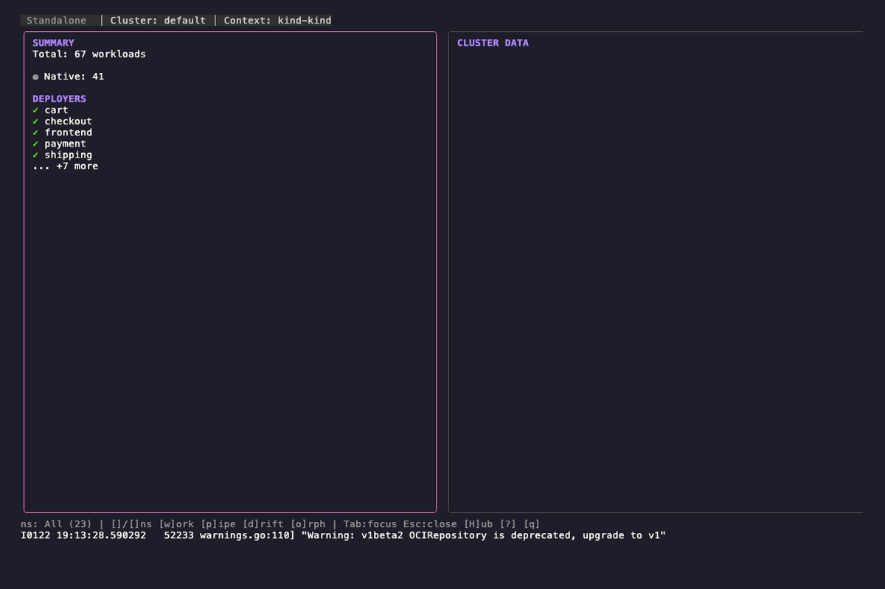

# cub-scout — observe and explain Kubernetes + GitOps

**Read-only. Deterministic. Offline-capable. Optional `cub` plugin.**

cub-scout is an open-source observer for Kubernetes and GitOps. It diagnoses, explains, traces, maps, scans, **compares** intended vs running state, and **attributes** every field back to its source — but it never modifies cluster state and never makes authority calls about what *should* be true. Safe to run against production.

It helps you answer:
- what owns this resource, really?
- where did each field's value come from — controller, git file, ConfigHub binding, or someone editing manually?
- what's broken right now, and what should I do next?
- how does **intended** (governed) state compare to **live** (cluster) state?

It works **standalone** with your current kube context, or **connected** to [ConfigHub](https://confighub.com) for governed comparison, history, import, fleet queries, and AI-friendly read-only workflows.

### Who reaches for cub-scout?

- **SREs and on-call** — when a workload is unhealthy and you need to know *why* and *who owns it* in seconds, not by clicking across Argo or Flux UIs.
- **Platform engineers** — when you inherit a cluster and need a trustworthy ownership map across Flux, ArgoCD, Helm, Crossplane, kro, ConfigHub, and naked YAML.
- **AI agents and automation** — when you need stable, deterministic JSON or a Model Context Protocol (MCP) gateway for read-only cluster facts.

### `cub-scout` vs `cub`: the boundary

| | `cub-scout` | `cub` |
|---|---|---|
| Role | **Observe and explain** | **Act and govern** |
| Cluster state | Read-only | Read + reconcile via workers |
| ConfigHub state | Read-only queries | Authoring, import, promotion |
| Best for | Diagnosis, ownership, drift, attribution, AI tools | Intended-state authoring, GitOps pipelines |

cub-scout is the **read-only witness**. ConfigHub (driven by `cub`) is the **authority**. The two ship as separate binaries and never overlap on writes.

---

## Capability Map

cub-scout's commands fall into eight groups. Each command's **Inputs** column tells you exactly what it needs — cluster only (standalone), cluster + a local git checkout (standalone + `--source-path` / `--git-path`), or cluster + ConfigHub auth (connected).

### Observe — see what's running

| Command | What you get | Inputs |
|---|---|---|
| `doctor` | One-screen cluster health summary with concrete next steps | cluster |
| `map` (TUI / `list` / `hooks` / `orphans` / `meaning`) | Ownership inventory, lifecycle hooks, orphan detection, meaning-first grouping | cluster |
| `trace` | Full ownership chain from K8s object → Application/Kustomization → Git source / OCI digest | cluster |
| `tree` | Runtime, ownership, git, and composition hierarchies | cluster |
| `scan` | Audit live cluster or manifest files against 46 built-in risk patterns | cluster *or* file |
| `graph export` | Resource graph as DOT/JSON | cluster |
| `snapshot` | Dump cluster state as GSF JSON | cluster |
| `watch` | Stream observation events to webhook/file sinks | cluster |
| `status` | Connection mode and cluster context info | cluster |

### Diagnose — interpret what you observe

| Command | What you get | Inputs |
|---|---|---|
| `explain` | Plain-English ownership and lineage for one resource, with phase-aware next-step hints | cluster |
| `debug` | Guided GitOps debugging wizard | cluster |
| `suggest-remedy` | Read-only description of a remediation that *would* resolve a finding — never applies it | cluster |
| `patterns` (`detect` / `explain` / `list`) | Pattern-engine catalogue + matched findings | cluster *or* file |
| `gitops status` | GitOps pipeline health across Flux + Argo controllers | cluster |

### Compare — intended vs actual

| Command | What you get | Inputs |
|---|---|---|
| `compare` (resource mode) | Single-resource DRY/WET/LIVE picture when connected; LIVE-only when standalone | cluster (+ConfigHub for DRY/WET) |
| `compare drift` | Desired (file) vs live drift detection | cluster + file |
| `compare three-way` | Scope-wide DRY/WET/LIVE with agreement summary and conformance verdict | cluster + ConfigHub |
| `compare source-truth` | Strategy-relative `PASS` / `WATCH` / `ASK` / `BLOCK` evidence Pilot consumes (#393) | cluster + ConfigHub |

Today, `compare three-way` and `compare source-truth` require ConfigHub. A standalone "git as DRY" mode is in the [next-up](#whats-coming-next) list.

### Verify — typed, fingerprinted, immutable evidence artifacts

cub-scout receipts (#446) are the **persistence** sibling of `compare`: where `compare` produces an ephemeral live picture, `receipt verify` wraps the same evidence into an in-toto Statement v1 envelope that CI/CD gates, audit trails, postmortems, and acceptance-judge tooling can attach to a decision and later re-check for tampering.

| Command | What you get | Inputs |
|---|---|---|
| `receipt verify <kind>/<name>` | Build a typed, fingerprinted receipt asserting a predicate. Predicates: `applied-matches-spec`, `source-truth-pass`, `no-manual-edits-since`. Verdicts: PASS / WATCH / BLOCK / INCONCLUSIVE. | cluster (+ ConfigHub for `source-truth-pass`) |
| `receipt verify --fail-on <verdict>` | Same, plus CI-gate exit semantics: exit 2 when the receipt's verdict matches the listed set (`WATCH` / `BLOCK` / `INCONCLUSIVE` / `any-non-pass`). Artifact is preserved on fail. | cluster |
| `receipt verify --input-attestation <path>` | Chain receipts: reference a prior receipt via `inputAttestations[]`. Each referenced receipt's fingerprint is verified before chaining; tampered receipts are refused. | cluster + prior receipt file |
| `receipt show <path>` | Render a saved receipt (ASCII or JSON). Does NOT verify the fingerprint — works on tampered receipts for forensic inspection. | receipt file |
| `receipt validate <path>` | Recompute and compare the receipt's fingerprint. Exit 0 OK / 1 mismatch / 2 I/O. | receipt file |
| `receipt list` | Walk the local store (`$CUB_SCOUT_RECEIPTS_DIR → $XDG_DATA_HOME/cub-scout/receipts → $HOME/.local/share/cub-scout/receipts`) sortable, newest first. | local store |
| `watch --emit-receipt-on <event-types>` | Real-time receipt emission: each matching watch event carries a receipt inline. All four known event types build receipts (`drift.detected`, `ownership.changed`, `resource.discovered`, `scan.finding`); per-poll backpressure controlled by `--emit-receipt-batch-cap` (default 10). | cluster |

Wire format: in-toto Statement v1 (`_type = "https://in-toto.io/Statement/v1"`) wrapping `https://cub-scout.dev/receipt/v1`. SHA-256 fingerprint over RFC 8785 canonical JSON of the full Statement minus only `predicate.fingerprint`. Read-only by construction — receipts emit artifacts, never mutate.

### Attribute — where each value came from

cub-scout's **attribution layer** (#435) annotates every field mismatch with provenance evidence:

| Signal | Surfaces on | Inputs |
|---|---|---|
| `cause` + `managerHint` (controller-drift / manual-edit / unknown) — from K8s `managedFields` | `compare` + `explain` | cluster |
| `gitSource.{repoUrl, revision, path}` — from Argo Application / Flux GitRepository spec | `compare` + `explain` | cluster (needs `argocd` / `flux` CLI for tracer) |
| `gitSource.file` + `gitSource.line` — raw-YAML back-resolution | `compare` | cluster + `--source-path <local-checkout>` |
| `incomingBindings[]` — ConfigHub Links influencing this unit | `compare` | cluster + ConfigHub |
| `bindingSource` — per-field upstream unit + binding path | `compare` | cluster + ConfigHub |

The verified manager-string enumeration covers Argo CD, Flux (kustomize / helm / source controllers), Helm direct, Crossplane (composite / composed / claim / MRD / refs), kro (applyset / parent / labeller), and `kubectl-*` interactive paths — strings not in the enumeration fall through to `unknown` rather than being guessed.

### Ingest — import config into ConfigHub

| Command | What you get | Inputs |
|---|---|---|
| `import --git-path` | Local Git-structure preview, no upload | git checkout |
| `import parse-repo` | Repo structure JSON for downstream tools | git checkout |
| `import argocd` | Import one ArgoCD Application's units | cluster + ConfigHub |
| `import cluster-aggregator` | Aggregate import proposals across many controllers | cluster + ConfigHub |
| `import apply` | Apply an import proposal JSON to ConfigHub | ConfigHub |
| `app` | Manage ConfigHub Apps | ConfigHub |

Today standalone `import --git-path` is preview-only. A `--output-dir` mode that emits proposed unit YAMLs to disk for review/PR/upload is in the [next-up](#whats-coming-next) list.

### Govern — connected fleet and history

| Command | What you get | Inputs |
|---|---|---|
| `history` | Connected ChangeSet timeline for one resource | ConfigHub |
| `impact` | Connected blast-radius preview for one unit | ConfigHub |
| `fleet outliers` | Cluster divergence report across many clusters | ConfigHub |
| `summary` (`list` / `slack`) | Connected summary storage + Slack delivery | ConfigHub |
| `views` (`resolve` / `open` / `project`) | Resolve, open, and project ConfigHub Views (#391) | ConfigHub |
| `audit list` | Break-glass accept/reject audit trail | ConfigHub |
| `bundle` / `catalog` | Inspect, replay, diff, and summarize debug bundles + manage catalogs | bundle artifact |

### Integrate — AI, setup, and infrastructure

| Command | What you get | Inputs |
|---|---|---|
| `setup connect` | Import or create a kubeconfig context | none |
| `setup completion` | Shell completion script | none |
| `quickstart demo` | Fixture-backed first-run tour | none |
| `mcp serve` | Read-only Model Context Protocol (MCP) server over stdio for Claude, Codex, agents | cluster (any subset of the above based on the tool invoked) |
| `context-pack` | Deterministic AI context JSON export | cluster |
| `version` | Build/version info | none |

All commands emit deterministic JSON via `--format json` for scripts and agents. Same input, same output — no AI/ML inference in the ownership logic.

---

## Fast Path (2 Minutes)

**No ConfigHub signup required.** cub-scout reads your current kube context and works fully offline.

```bash
brew install confighub/tap/cub-scout

cub-scout doctor                                  # cluster health summary
cub-scout explain deploy/api -n prod              # who owns this resource?
cub-scout trace   deploy/api -n prod              # where did it come from?
cub-scout map                                     # interactive TUI
```

If `cub-scout: command not found` but you have `cub` installed, try `cub scout doctor` instead — see [How to invoke](#how-to-invoke).

---

## Install

```bash
# cub plugin (preferred for ConfigHub users — one install, shared auth)
cub plugin install confighub/cub-scout
cub scout version

# Homebrew
brew install confighub/tap/cub-scout

# Go install
go install github.com/confighub/cub-scout/cmd/cub-scout@latest

# Binary download
curl -sL https://github.com/confighub/cub-scout/releases/latest

# Container
docker run ghcr.io/confighub/cub-scout:latest version

# kubectl krew
kubectl krew install cub-scout
```

`make build-kubectl-plugin` also produces a `kubectl cub-scout ...` wrapper. See [docs/howto/plugin-install.md](docs/howto/plugin-install.md) for pinned-version, direct-URL, and offline installs.

---

## How to invoke

Same binary, three invocation forms — commands, flags, JSON, exit codes, and MCP tool names are identical across all three; only the prefix differs:

```bash
cub-scout doctor          # 1. Standalone — installed directly
cub scout    doctor       # 2. cub plugin — after `cub plugin install confighub/cub-scout`
kubectl cub-scout doctor  # 3. kubectl plugin — from `make build-kubectl-plugin`
```

Plugin form (`cub scout ...`) inherits `cub`'s auth automatically — useful when you also use ConfigHub. Standalone form is the path of least resistance and the default for AI/MCP scenarios. Parity is enforced by a release-gate test (`TestPluginParity_StandaloneMatchesPlugin`).

---

## Standalone vs Connected

cub-scout works fully offline. Connected mode is optional but unlocks the questions a live cluster alone cannot answer.

**Standalone (no signup):** ownership detection, tracing, health diagnosis, drift hints, risk scanning, JSON, MCP gateway, attribution via `managedFields` + Argo/Flux tracer + (with `--source-path`) raw-YAML file:line resolution.

**Connected (`cub auth login`):** adds the historical and cross-cluster context the Kubernetes API doesn't have:

- **DRY vs WET vs LIVE** — compare what ConfigHub *intended*, what the renderer *produced*, and what's actually *running*. Catches drift the live cluster can't tell you about.
- **Per-field binding source** — answer "this field's value came from upstream unit X at path Y via link Z."
- **Change history** — `kubectl events` only goes so far; `history` walks the ConfigHub governed timeline.
- **Fleet queries** — "is this version running everywhere it should?" across many clusters.
- **Import preview** — propose how a live workload should be modeled in ConfigHub before writing anything.

**Important:** connected import writes ConfigHub records, not cluster manifests. cub-scout never modifies the cluster.

---

## Signature Example

`trace` is the headline feature — it answers "what created this?" without making you stitch Deployments, Applications, Helm releases, labels, annotations, and controller state by hand:

```text
$ cub-scout trace deploy/frontend -n boutique

TRACE: Deployment/frontend in boutique
Owner: Flux
Source: GitRepository/flux-system/platform-config
Path: clusters/prod/apps/boutique
Status: Ready

Recent events:
  Warning BackOff (3x, 5m) kubelet: Back-off restarting failed container

Next:
  cub-scout explain deploy/frontend -n boutique
```

For more, see [docs/reference/commands.md#trace](docs/reference/commands.md#trace).

---

## Interfaces

| Interface | Best for | Start here |
|---|---|---|
| TUI | Interactive exploration, keyboard-driven debugging | `cub-scout map` |
| CLI | One-off triage, shell use, pipelines | `doctor`, `explain`, `trace` |
| JSON | Automation, AI, MCP, downstream tooling | `--format json` or `--json` |

Press `?` inside the TUI for shortcuts.



### Scan Variants

`scan` is the fastest way to audit a cluster or manifest set for known risk patterns. The built-in scanner covers **46 patterns**, and the broader [confighub-scan](https://github.com/confighubai/confighub-scan) catalog tracks **3,513 risk patterns** for deeper policy and detection work.

Common entrypoints:

- `cub-scout scan --state`
- `cub-scout scan --kyverno`
- `cub-scout scan --lifecycle-hazards`
- `cub-scout scan --timing-bombs`
- `cub-scout scan --dangling`
- `cub-scout scan --file manifest.yaml`
- `cub-scout scan --json`
- `cub-scout scan --normalized-json`

Detailed scanner behavior and output shape: [docs/reference/commands.md#scan](docs/reference/commands.md#scan) and [docs/reference/json-contracts.md](docs/reference/json-contracts.md).

---

## AI integration

For Claude, Codex, and other AI agents:
- start with [AI-README-FIRST.md](AI-README-FIRST.md)
- then load [skills/cub-scout/SKILL.md](skills/cub-scout/SKILL.md) if repo-local skills are supported
- for AI tool setup, see [docs/howto/using-cub-scout-from-ai-tool.md](docs/howto/using-cub-scout-from-ai-tool.md)

`cub-scout mcp serve` is a read-only MCP server over stdio backed by the same CLI JSON surfaces — same answers, agent-shaped. It's not a Kubernetes write tool, not a multi-gateway router, and not the ConfigHub authority layer (that role belongs to `cub`).

---

## What's coming next

Honest gaps in the current capability map, with the leverage on filling them:

- **Standalone `compare three-way --git-path` / `--source-path` as DRY source** — would let raw-YAML repos run the same three-way view without ConfigHub. Stage B back-resolution (#440) already lays the parsing groundwork.
- **`compare source-truth` Phase 3 (multi-source Argo)** — [#409](https://github.com/confighub/cub-scout/issues/409) Phase 1 (4 strategies) and Phase 2 (5 more strategies: `helm-flux`, `helm-argo`, `kustomize-flux`, `oci-flux`, `oci-argo`) already shipped (9 strategies total). Phase 3 — multi-source Argo `spec.sources[]` len > 1 — is the remaining open scope.
- **`import --git-path --output-dir`** — emit proposed unit YAMLs to disk for PR review, then upload via Installer's `--merge-external-source` once connected. One bundle, two workflows.
- **Hierarchy-aware ingest** — preserve ApplicationSet / app-of-apps / Flux Kustomization composition in import proposals so imported ConfigHub state is navigable, not flat.
- **Helm / Kustomize back-resolution** — extends stage B (#440) from raw YAML to templated sources for per-field `file:line` provenance.
- **Additional manager-string writers** — Tekton, Argo Workflows, Cluster API, OIDC-based CD systems — gated on whether the variant-management story demands them.

---

## Documentation Map

| Need | Doc |
|---|---|
| Workflow-first CLI tour | [CLI-GUIDE.md](CLI-GUIDE.md) |
| Full command catalog (A–Z) | [docs/reference/cli-reference.md](docs/reference/cli-reference.md) |
| Command usage and examples | [docs/reference/commands.md](docs/reference/commands.md) |
| Stable flags and schemas | [docs/reference/cli-contract.md](docs/reference/cli-contract.md) |
| JSON fields and output model | [docs/reference/json-contracts.md](docs/reference/json-contracts.md) |
| Getting started checklist | [docs/getting-started/checklist.md](docs/getting-started/checklist.md) |
| Import and migration path | [docs/howto/import-to-confighub.md](docs/howto/import-to-confighub.md) |
| AI tool integration | [docs/howto/using-cub-scout-from-ai-tool.md](docs/howto/using-cub-scout-from-ai-tool.md) |
| Examples and demos | [examples/README.md](examples/README.md) |
| Receipts (typed evidence artifacts) | [examples/receipts/README.md](examples/receipts/README.md) + [docs/reference/json-contracts.md § Receipt Contract](docs/reference/json-contracts.md) |
| Receipt and proof terminology (vs log / journal / record / ledger / provenance) | [docs/concepts/receipts-and-proofs.md](docs/concepts/receipts-and-proofs.md) |
| Receipts end-to-end how-to (pre-deploy gate → audit chain → namespace aggregate → real-time emission) | [docs/howto/receipts-end-to-end.md](docs/howto/receipts-end-to-end.md) |
| Watch event types + inline receipts + backpressure | [docs/reference/watch-events.md](docs/reference/watch-events.md) |
| Security model | [SECURITY.md](SECURITY.md) |

---

## Build From Source

```bash
git clone https://github.com/confighub/cub-scout.git
cd cub-scout
go build ./cmd/cub-scout
./cub-scout version
```

---

## Principles

- **Read-only, by design** — observation uses only `Get`, `List`, `Watch`. No `apply`, no `delete`, no admission webhook. Even `suggest-remedy` only *describes* a fix — it does not run it.
- **Deterministic** — same inputs, same outputs. No AI/ML inference in the ownership logic.
- **Parse, don't guess** — ownership and attribution come from real labels, annotations, owner references, controller facts, and verified manager-string enumerations. Unknown is preferred over wrong.
- **Complement GitOps, don't replace it** — cub-scout helps you understand Flux, ArgoCD, Helm, Crossplane, kro, and ConfigHub state. It's not another reconciler.
- **Graceful degradation** — works without ConfigHub, without internet, and many flows work without a live cluster (debug bundles, manifest scans, Git-path import preview).
- **Evidence, not authority** — cub-scout is the read-only witness. ConfigHub (via `cub`) is the authority for intended state.

For more on the security model, see [SECURITY.md](SECURITY.md).

---

## Contributing

Contributions welcome. See [CONTRIBUTING.md](CONTRIBUTING.md).

- **Found a bug?** [Open an issue](https://github.com/confighub/cub-scout/issues)
- **Have an idea?** Start a discussion
- **Want to contribute?** PRs welcome

---

## Community

- **Discord:** [discord.gg/confighub](https://discord-auth.confighub.net/discord/join)
- **Issues:** [GitHub Issues](https://github.com/confighub/cub-scout/issues)
- **Website:** [confighub.com](https://confighub.com)
