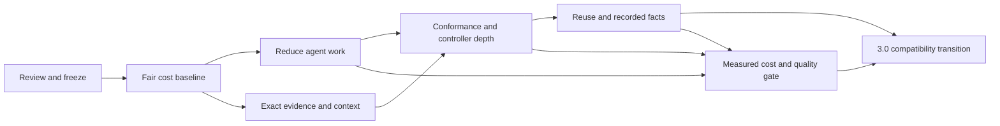

# Delivery plan to cub scout 3.0

Adopted 2026-09-30 by the maintainer: “make this official, github sync, then
proceed. execute your plan without stopping - loop until done.” This is the
execution companion to the [authoritative roadmap](roadmap.md#path-to-30).
The sequence, staffing, staged budgets, targets and decision defaults below
are authorized for execution. They remain plans, not measured results or
calendar promises. Execution tracker: [#645](https://github.com/confighub/cub-scout/issues/645).
Existing issue owners remain responsible. The lead agent
executes, obtains independent review, verifies CI and evidence, and merges
reviewed changes; release and paid-run work stays within the adopted gates and
budgets. External ConfigHub design dependencies are not presumed resolved.

## Outcome and value proposition

**GitOps explorer for agents: verified answers with less agent spend.**

The product goal is for Claude using cub scout to spend fewer dollars, tokens,
and account credits reaching a correct, supported answer than standalone Claude
with ordinary read-only tools. Saving time matters too. Being callable by an
agent is insufficient; cub scout must eliminate work the model otherwise does:
resource discovery, repeated parsing, joins, attribution, status interpretation,
and unnecessary verification calls.

Use this public wording until the gates below pass:

> cub scout gives agents compact, explainable Kubernetes and GitOps evidence.
> We measure whether it lowers the cost and time of a verified answer compared
> with standalone Claude, and publish the workloads where it helps or adds cost.

After passing, replace the second sentence with the measured percentage,
model/version, task mix and date. Do not promise universal savings. Keep the
headline “GitOps explorer for agents”; define agentic by demonstrated savings.
The separate ConfigHub/Pilot write-path value proposition is **cost per verified
successful change**, tracked in [#642]; it cannot be claimed from scout's
read-only answer benchmark.

The boundary remains: scout supplies deterministic observations and scoped
checks; the agent/Pilot interprets them and orchestrates work; ConfigHub governs
intended state and authority. No model inference inside ownership detection,
no cluster mutation, no new fleet membership model, and no renderer hidden in
`import --git-path`. ConfigHub fact publication has a distinct, explicit write
boundary even though observing the cluster remains read-only.

## Execution checkpoint — 2026-10-01 (00:40 UTC)

Code baseline is `624c7cf`. #691–#694 are merged with review and required CI: current
handover, pinned recorded scale preparation, opt-in recorded summary/owner
views and explicit basic/views preflight contracts. Default JSON remains
byte-identical. The four-view CLI/MCP binary preflight passed; product output
retains input hashes, scope, unknown capture time/completeness and the Native
ownership limitation. Smaller responses alone do not establish agent savings.

INV-01/02 now map to **prepared recorded bindings, not model runs**. The fixed
24-case design comprises 10 planned, five refreshed, two prepared bindings,
six prepared projections and one prepared raw recording. It remains
non-executable. Actual tool/grant parity and grading gates are pending;
file-tools-only staging is narrower than the full standalone-tool comparison.
The strict answer-contract packet is opt-in and preserves historical results.

Revision-correlation PR #695 is merged as `624c7cf` after review, local
validation and required CI. Its digest equality must not imply execution or gate
acceptance; live ConfigHub correlation remains unverified. v2.12.4 is still
the published release. Paid execution remains $4.2655744 estimated inclusive
list price, development dollars/credits are unmeasured, and no paid retry is
queued. Continue bounded cheap workers at normal speed under
[#645](https://github.com/confighub/cub-scout/issues/645). See the
[current handover](../HANDOVER.md) for validation limits and external gates.
Earlier checkpoints below are historical.

## Execution checkpoint — 2026-10-01 (23:48 UTC on September 30)

Main is `61b05bf`; v2.12.4 remains the published release. #681/#682, the negative
routing report #684, the next-minor fleet-outliers notice #685, evidence cases
#686/#687/#688 and delivery mappings #690 are merged. The fixed 24-case design
now has 10 planned cases, five refreshed cases, two awaiting snapshot binding,
six prepared projections and one prepared raw recording. It is still
non-executable; input controls and equal-tool/protocol gates remain pending.

#689 adds one recorded ownership model across CLI, TUI and MCP, with exact
input hash/scope and unknown capture time/completeness. The full offline suite,
binary surface proof on 302 input/300 selected Deployments, independent review
and required CI passed. This enables the next offline scale-binding packet;
it is not an agent-cost result. Its preparation/preflight draft is in review
repair, with no model run or new local cluster capture. Economical count-only and
no-marker-only views remain follow-up work under #604. PRE-01/02 remain planned:
source renders and narrative receipts do not establish raw destination failures.

Paid execution is unchanged at $4.2655744 estimated inclusive list price;
development dollars/credits remain unmeasured and the $200 baseline tranche
is unspent. No savings claim is established. Continue with bounded cheap
workers at normal speed; the external governance/storage/access gates remain
unresolved. See the [current handover](../HANDOVER.md) and
[#645](https://github.com/confighub/cub-scout/issues/645) for the execution queue.
The older dated checkpoint below is historical.

## Execution checkpoint — 2026-09-30 (status as of 22:45 UTC)

v2.12.4 is published at `11c3e38`, with the six correctness fixes and reviewed
#640/#643. Published archives and supported macOS/Linux entry points are
verified; see the [release record](releases/v2.12.4.md) for checks and omissions.
The adopted plan (#644), binary verified-answer/inclusive-cost accounting
(#646), equal-raw-evidence fixtures (#648), exact-field evidence/routing
(#658/#659), scoped explicit context (#665), compact ownership diagnostics
(#667), recorded exact-object explain (#668), Helm storage-identity checks
(#670) and the `/v2` module migration (#671) are merged. These later changes
remain unreleased. #673 also completed a pinned Helm 3.22.0/Helm 4.1.4
disposable-cluster matrix: fresh installs for both versions plus a Helm 3-to-4
upgrade across three releases and four observations. Standalone and plugin
Scout traces agreed. The Helm 4 upgrade used explicit `--server-side=auto`, so
it is not evidence for default apply behavior. The upgrade preserved Deployment
UID while ready replicas changed 1→2. Scope is namespaced install/upgrade only;
hooks, CRDs, rollback and server-side conflict behavior remain untested.
Manager names alone do not establish apply method, and this does not close #588.
#677 provides the genuine HLT-02 Flux capture; its separate answer case #681 has review clearance,
but required CI is pending and it is not merged. The capture is sequential
evidence, not current state or a paid result.
#678 fixes Helm 3 empty `deleted` timestamp decoding, with malformed values
still rejected. #679 prepares an opt-in bounded economy-probe purpose; it does
not itself establish savings.

#669 records an actual one-pair recorded-MCP plumbing diagnostic; both arms
read the full raw fixture and ambiguous owner/field-manager wording limits
interpretation. A further recorded-MCP economy pair scored 0/2 binary answer
checks at $0.1588988; its report is merged in #680. Another economy-skill pair
scored 0/2 at $0.1607222 (with: $0.0811486/22s; without: $0.0795736/19s).
Both arms reported three turns and made two raw-file reads; despite the visible
attribution skill, neither called it or the MCP tool. No retry is queued, and
no routing improvement is established. Its report is being prepared separately.
Routing-preparation PR #682 has review clearance, but its required CI was pending
at this snapshot.
Paid execution totals $4.2655744 estimated inclusive list price: $2.4692065
live-only and $1.7963679 smoke/probe. Account credits and development-agent cost
are
unmeasured; the $200 baseline tranche is unspent. The fixed 24-case benchmark
remains non-executable with 14 planned cases, five refreshed cases, two awaiting
snapshot binding and three prepared source projections. Neither diagnostic
demonstrates savings, and the
general savings gate has not passed. Current next packets and external
dependencies live in
[#645](https://github.com/confighub/cub-scout/issues/645) and the latest
[handover](../HANDOVER.md). Do not repeat P0 release work from the historical
starting snapshot below.

Aggregate Codex goal telemetry at 22:45 UTC showed 12,992,646 tokens, with no
attributable model/cache/credit accounting. It cannot establish dollar spend or
certify the initial 60-credit envelope. Reforecast directionally toward bounded
offline fixtures; do not infer a precise remaining-dollar amount or schedule
another paid retry.

## Starting snapshot at adoption — before September 30 execution

The following records the pre-execution state, not the current work queue.

- Published baseline: v2.12.3. Six fixes (#625, #629, #630, #631, #634, #637)
  are merged but unreleased. Review #640 separately; do not wait for all 3.0
  work to release correctness fixes.
- [PR #643] prepares live-only scale cases, strict result-completeness reporting,
  and exact resource-list graders. It is a draft dependency, not shipped proof.
  Its saved live-only run is interrupted; the completed comparison is pending.
- The September 27 scale pilot reported 9/9 versus 8/9 correct and 11% lower
  cost per correct answer across three cases. It was slower overall and has
  only three repeats. Attribution results gave scout managedFields that the
  baseline export lacked. Neither result establishes the general value claim.
- The current reporter's fractional score denominator is useful diagnostically,
  but is not yet a count of independently verified successful answers. Add the
  binary success metric before making the new headline claim.

## What the five integrations teach us

Source commits and permanent links are below. These are repository-recorded
observations, not live tests repeated for this plan. Old receipts establish
past behavior on their named versions; they do not certify today's cluster.

| Source and evidence | Lesson for scout | Delivery package / proof |
|---|---|---|
| Sveltos, September 30 measured [known behaviours][sveltos-known] | Healthy gate acceptance is not exact-release health. Applied release is inferred from times; a refreshed report can carry old health checks. `validateHealths` is deployment-time; continuous workload health is separate. | P3 / [#641]: report controller fact, gate observation, revision binding method and freshness separately. Tests for wrong/ambiguous revision, clock skew, refreshed old health, Provisioned with a failed workload. |
| Kubara [platform evidence][kubara-evidence] | Desired render, component/cluster placement, and live observation are different evidence. Disabled is not unhealthy; unobserved is not unmanaged. | P3/P4 / [#594], [#596], [#599]: fixtures with duplicate names across hub/spokes, explicit target binding, missing live fields and NotApplicable. |
| Kubara [fresh-organization checklist][kubara-fresh] | Offline success does not certify a fresh organization or current server. Its staged checklist still names an older cub version. | P1/P3: retain historical proof, capture fresh cub 0.6/server-version fixtures for new joins, and mark unavailable live acceptance pending. Never reuse old command examples as current CLI truth. |
| Flux [handover proof][flux-handover] and [status contract][flux-status] | Applied digests can be observed directly. Ready alone is not workload health unless checks ran. Handover/rollback can preserve UIDs and rollout revisions; bootstrap remains the recovery path. | P3/P4: exact digest joins, check-scope evidence, preserved identity, and owner-versus-deliverer fixtures; scout observes a handover, never performs it. |
| Argo [live estate and publication proof][argo-guide] | Publishing an OCI release does not guarantee reconciliation; the recorded second release needed a hard refresh. Parent/child state, sync windows, tracking and immutable source identity matter. | P3/P4: published-but-not-consumed and stale-tag fixtures; parent Synced is not a substitute for child coverage. Preserve the guide's caveat that one sourceRepos step used a Unit edit rather than a Git commit. |
| helm-expt [large-operation receipts][helm-large] | Consul workloads can converge while Argo remains Synced/Progressing due to a named Ingress. Render parity does not execute lifecycle hooks. Prerequisites include CRDs, secrets, cloud APIs and schedulable-node topology. | P3/P4: name the first incomplete stage and residual object; never turn workload success into total PASS. Reuse exact rows, not aggregate chart-count claims. |
| helm-expt [NGINX evidence chain][helm-oci] | Installer input, rendered configuration, output OCI manifest, bundle content and running image identities differ. One output digest was delivered through three consumers. | P3/P4 / [#561], [#584]: typed identity joins and negative swapped-digest fixtures; no inference from tags. |

A specific correction to [#641]: its September 28 description of the Healthy
triple is not sufficient to specify the contract. The September 30 Sveltos
measurements distinguish prerequisite acceptance from automatic order advancement.
P3 must verify each against a pinned ConfigHub server and record exact semantics.
A gate accepting an annotation is a reported fact, not authority for scout to
approve a release or proof of the release running.

## Sequence, work packets and exit gates

Planning capacity: one lead/integrator, up to two cheap implementation workers,
and one serial live-validation lane. The windows are **engineering-week ranges
from kickoff**, assuming dependency decisions and credentials arrive in time;
reforecast after the first three packets. They are not calendar commitments.
Do not start all roadmap issues in parallel.
Allow another two to four weeks of contingency for controller adapter failures
and external ConfigHub decisions; reforecast cost as well if the window expands.

| Packet / target window | Concrete deliverable and issue scope | Dependency | Lead / delegated work | Exit gate |
|---|---|---|---|---|
| P0, days 1–2 | Review #643 and #640 independently; prepare v2.12.4 for the six merged fixes; freeze benchmark manifest, versions and budgets. | None | Lead handles review/release recommendation; cheap worker checks fixture/claim inventory. | Reviewable PRs; known green checks; no partial run presented as complete. Release follows the adopted D1 decision and publication checks. |
| P1, week 1 | [#603]: complete/regrade live-only experiment; create equal-information baseline, binary success and cost ledger; select the 24 cases below; reproducible pinned-model command and bounded CI design. | #643 reviewed; authenticated eval runner for paid portion | Cheap worker builds offline harness/tests; lead approves scoring; logged-in runner executes paid cases serially. | Graders fail without fixes; model/evidence/cost provenance complete; interrupted runs retained and excluded from complete claims. Baseline published with limits. |
| P2, weeks 1–2 | [#626], [#603], [#604]: fix routing on attribution prompts; shorten discovery descriptions; prototype per-entry owner evidence and omission reasons for compact `map`; preserve drill-down. | P1 test definitions; does not wait for the whole paid suite | One cheap worker per bounded skill/output slice; lead reviews evidence semantics. | Fewer redundant calls/bytes on affected cases, unchanged correctness; no broad “unmanaged” claim from absent or unreadable metadata. Keep only measured improvements. |
| P3, weeks 2–3; v2.13 | [#641] read-side decisions, [#591], [#597], [#561] leftovers, [#588], [#599] explicit context; `/v2` per [#595]/[#520]. Separate small PRs, not one rewrite. | P1 fixture contract; decisions D2–D4 | Lead designs joins and safety; cheap workers port recorded fixtures, implement settled adapters and docs. | cub 0.6/server-pinned governance fixtures; exact-identity/freshness negative tests; explicit context never changes shared context; required tests/examples/live proof. v2.13 baseline and cost result published. |
| P4, weeks 4–6; v2.14 | [#596] six-surface conformance; [#599] cluster identity/request cost; [#604] output budgets and recorded mode before HTTP; [#594] matrix; [#601] Crossplane v2, [#602] Rollouts, [#584] workload/image adapters. | P3 contracts; each adapter adds an eval case | Cheap workers implement independent fixture-backed adapters; lead reviews UID chains, completeness and transport isolation. | All six surfaces preserve facts/omissions; each matrix cell cites a fixture plus appropriate live proof; Crossplane loses experimental status only when its gate passes. HTTP gets its own auth/scope tests. |
| P5, weeks 7–9; v2.15 | [#539] reuse/watch efficiency, [#600] fact schema/store, [#641] reporter fallback, [#520] pullable bot image, [#605] evidence history; ship deprecation notices. Prototype read reuse in P2/P4, ship the watch-backed default here. | P4 identity/freshness/cost contract; ConfigHub storage agreement; D5–D7 | One cheap performance worker and one fixture/history worker; lead owns publication semantics. | Idle/change/denied/reconnect API counts measured; stale evidence cannot renew itself; no competing reporter overwrite; repeat publication is idempotent; bot artifact pulled in clean cluster. Notices ship at least one minor before removal. |
| P6, weeks 10–11; 3.0 | [#595], [#562], [#386]: retire documented deprecated surfaces, enforce cub >=0.6, decide fleet outliers, `/v3`, migration guide, coordinated plugin/standalone artifacts and cost report. | P5 deprecation window; product cost gate; D7 | Cheap worker runs compatibility matrix/docs; lead performs final semantic review and release recommendation. | Golden CLI/JSON/MCP diff explained; migrations and published binaries checked; value claim passes or remains explicitly scoped. No silent regression or unmeasured general savings claim. |

Keep the existing release allocation. HTTP, Crossplane breadth or a fact-store
dependency may slip to a later minor; do not hide an incomplete gate by renaming
a version. Helm/Kustomize back-resolution [#481], Grafana [#432], Commander/TUI
integration [#519]/[#421]/[#422], more controllers [#607], Git-host publication
[#606] and scanner restoration [#534] remain outside this critical path.

September 30 execution refinement ([#649](https://github.com/confighub/cub-scout/issues/649)):
P1/P2 must distinguish resource-level mutation hints from exact-field evidence.
`explain.mutationManager` is representative metadata, not proof of a particular
field's latest writer or a person. Attribution cases must include path-specific
counterexamples and recorded/live/source limits; a correct final label alone
cannot establish a general answer-quality or savings claim.

## Contract to settle before adding more adapters

P3/P4 use one evidence model, projected through the existing surfaces:

- Identity: explicit cluster/context and object UID; intended release, observed
  controller revision and running image digest have distinct fields and types.
- Provenance: original controller/source fields, observed versus derived versus
  unavailable binding, evidence reference and scope. Never silently promote a
  reporter's time-based correlation into an independently verified join.
- Health: delivery/sync, workload convergence, application checks and aggregate
  controller health are separate. Include named blocking/residual objects.
- Time: report time, underlying observation/check time when known, generation
  and coverage; an unknown underlying timestamp stays unknown after refresh.
- Cost: requests, bytes, elapsed time, cache reuse and omitted evidence.
  These are provider-work metrics, not a substitute for the agent's token bill.

Read missing metadata as an omission; RBAC failure as unreadable coverage;
unsupported kinds as unsupported. Do not infer orphanhood from any of them.
Use Kubara's component/cluster separation and helm-expt's stage sequence:
intended/rendered -> published -> controller consumed -> prerequisites ->
workload convergence -> aggregate/application health. A missing stage stays
missing. Stages belonging to other tools are observed from supplied receipts or
APIs, never reimplemented as mutation in scout.

For [#641], recommended disposition: (1–2) add a versioned gate-acceptance fact
without changing scout's existing verdict meaning; (3) prove or explicitly lack
revision binding; (4) retain source messages explaining unknown health;
(5) add scoped ClusterSummary and continuous-health evidence with separate
semantics; (6) import sanitized fixtures with source/version provenance;
(7) provide the fallback reporter with the adopted explicit connected-bot
opt-in default (D5); resolve race-safe ownership and storage details under
[#600] before enabling publication. Standalone never publishes.

## Measuring whether cub scout saves users money

### Experiments

**A: fair primary comparison.** Same pinned Claude model/version, prompts,
permissions, cluster snapshot, tool/time budgets and cache conditions. Baseline:
Claude with ordinary read-only kubectl/Helm/file tools and complete equivalent
raw evidence, including managedFields. Treatment: the same Claude plus scout's
skills/MCP and access to that same raw evidence. Scout's discovery/schema cost
is included. The model may cross-check: that is a real cost to improve, not a
reason to remove baseline access selectively.

**B: realistic workflow comparison.** Scout-only live tools versus the normal
operator baseline with equivalent live read-only access; export-only comparisons
are separately labeled historical workflow experiments. Run from a frozen/reset
fixture and use the same task prompt. The prepared `*-live` cases are useful,
but their absent-plugin arm has no data and is not a valid baseline. Pair it
explicitly with the appropriate recorded baseline and disclose the difference.

**C: cheaper model enablement.** After A passes, test a cheaper Claude with scout
against both that same cheaper Claude without scout and the reference Claude
baseline. Attribute tool savings and model substitution separately. Do not
switch model in only one arm and call the entire difference a scout effect.

Record CLI/model/scout versions, commit, fixture hash, server/controller versions,
prompt/grader version, cache treatment, source permissions, wall time, token
usage, retries, subagent/mock/judge cost and any human intervention. Alternate
arm order. Development cases and held-out release cases must be distinguished;
freeze the held-out prompts before optimizing output against them.

### Balanced first suite: 24 cases, six equally weighted groups

| Group | Four questions / failure controls |
|---|---|
| Inventory | owner counts at scale; exact unmanaged list; one simple label lookup where plain Claude should do well; partial/RBAC inventory without false orphan claims |
| Attribution | manual set-image; manual scale; controller-only change; copied Argo instance label versus tracking-id, all with equal raw evidence |
| Delivery identity | Flux applied digest; Argo new publication not consumed; Sveltos inferred revision versus exact proof; OCI manifest versus bundle versus image mismatch |
| Health | Sveltos Provisioned after workload failure; Flux Ready without workload checks; Consul workload convergence with Ingress residue; missing/old/renewed report timestamps |
| Prerequisites / graph | missing CRD; Kubernetes topology/cloud prerequisite; Argo/Crossplane child-chain failure; Kubara intended hub/spoke placement with missing live observations |
| Reuse / limits | repeated question using a dated snapshot; cache invalidation after identity change; denied cluster alongside a readable one; unsupported workload/image proof returning unknown |

Use source-derived recorded fixtures, deterministic reference answers and
binary success: every mandatory claim supported, required omissions included,
no false health/ownership/release assertion. Fractional grading remains visible
but does not count half an answer as a verified success. Retain refusals,
timeouts, incomplete runs and spent cost in the accounting. Failed-arm costs
must not disappear; an abandoned experiment is reported as partial, not pooled
into a completed headline. Regrade old transcripts if possible before paying
to rerun only because a grader changed.

### Metrics and adopted release thresholds

Primary: `total arm spend / number of independently verified successful answers`.
Zero successes is undefined/infinite, never zero dollars. Publish raw counts and
both total and task-balanced costs; show each group so easy tasks cannot hide
an expensive or inaccurate controller class.

| Measure | Adopted target for the 3.0 savings claim on the tested suite |
|---|---|
| Quality | No lower observed verified-success rate; every mandatory negative case correct. Predeclare a 2 percentage-point non-inferiority margin: the paired 95% interval for the success-rate difference must not extend below -2 points. If unresolved, keep the evidence descriptive and the claim narrow. |
| Dollars | At least 20% lower cost per verified answer; paired task-level bootstrap interval excludes no saving. Predefine analysis and weights. |
| Credits / tokens | At least 20% lower measured account-credit cost where attributable; otherwise publish input/output/cache tokens and list-price equivalent, with actual credits **not measured**. Never equate provider credits or infer savings from remaining account percentages. |
| Time | Target 20% lower median time; report p95 and investigate >10% p95 regression. Cheap development may be slower; that does not excuse a misleading product speed claim. |
| Mechanism | Fewer tool calls, bytes ingested, duplicate reads or reasoning turns explain the saving; include plugin/schema overhead. |

Start with three repeats per arm for diagnosis, then ten for release evidence.
Ten repeats are a starting sample, not an automatic significance guarantee.
Even a passing gate supports only the named test suite and model, not universal
or population-wide equivalence.
If uncertainty remains, pre-budget another block of runs or keep the claim
scoped; never stop selectively when a favorable ratio appears. Results must be
model-specific. A failure to meet a target feeds P2/P5 or narrows the claim,
not a post-hoc change to tasks or success criteria.

Product priority follows marginal saved dollars per verified answer: routing
and compact evidence first, bounded drill-down second, reuse third, new breadth
where named tasks justify it. Optimize defaults only after tests show omissions
and coverage survive compression. Do not sacrifice explainability for bytes.

## Preplanned economical agent staffing

Use cheap workers for bounded evidence extraction, fixture transcription,
settled adapters, documentation and contract checks. Use the lead for interface
choices, conflicting evidence, UID/revision/freshness semantics, and final
review. A more capable model at normal speed is the escalation for reasoning
failure; maximum speed is not a substitute for better reasoning.

| Work type | Default assignment | Budget / stopping rule |
|---|---|---|
| Source audit or fixture inventory | One Luna worker, short task brief, no inherited full chat | Plan 50k total input + 10k output tokens; one concise evidence memo; no recursive delegation. |
| Settled adapter/test change | One Luna worker owns an explicit file set | Plan 200k total input + 20k output tokens; one implementation plus one repair attempt, then return evidence for escalation. |
| Contract or authority-sensitive design | Lead/Sol-class worker; normal speed | Plan 200k total input + 20k output tokens per decision packet; decide once, then delegate implementation. |
| Independent review | Cheap worker checks mechanical invariants; lead reviews semantic risks | One review per final diff, not a team rereading the whole repo after every edit. Escalate a concrete unresolved finding. |
| Live proof / paid eval | One runner, serial | Offline preflight first; immutable result file; explicit cost/time cap; no speculative parallel kind clusters. |

Default implementation concurrency is two workers plus the lead. Three disjoint
read-only audits are reasonable for this planning step (the five integration
sources were split that way). Parallelism reduces latency; it does not itself
save money. Do not dispatch a task whose coordination/review cost exceeds doing
it directly. No worker redoes another worker's source review. Reuse a pinned
source memo and fixture index; do not fork full chat history into routine work.

**Normal/standard speed by default.** Use a slower supported service tier for
non-urgent offline tasks if the actual client exposes it; do not assume that
this delegation API has a tier switch. Check effective mode before dispatch
and do not assert a requested tier was enforced without evidence. Max speed
requires a documented deadline that standard execution cannot meet and a
specific necessary task; record its extra cost. Nothing on this roadmap
currently requires it. The [official speed documentation][codex-speed] confirms
that faster modes consume more usage; API and subscription billing differ.

For a transparent planning example, the September 30 [standard credit rate
card][codex-pricing] lists Luna at 2.5/0.25/12.5 credits per million
input/cached-input/output tokens; Sol at 50/5/250. Thus 50k uncached input +
10k output is **0.25 Luna credits versus 5 Sol credits**, before retries and
orchestration. A 200k/20k packet is 0.75 versus 15. These are illustrative
credit-billed token calculations, not predictions of included plan usage,
actual task cost, or API dollars. Count all calls and context rereads.

Allocate the first three implementation packets **45 lead/review credits plus
3 cheap-worker credits and 12 reserve credits** as a provisional 60-credit
planning envelope under those rates. These are authorized accounting limits,
not tool-enforced caps or a new credit purchase. Reforecast using actual token and
credit telemetry after those packets; do not invent a whole-project dollar
quote from unmeasured task sizes. Track dollars, attributable credits, human
minutes and elapsed time in separate columns. If per-task billing is unavailable,
record token estimates with that limitation, never a precise claimed saving.

Each packet records: issue, input files, expected artifact/tests, assigned model
and effective speed, input/output estimate, actual usage, retries, lead review
cost and outcome. Escalate once after two failed bounded attempts or immediately
for an unresolved identity/authority ambiguity. Stop duplicated work at once.
Target at least 70% of suitable routine packets on cheap workers, but judge the
policy by **total cost per accepted change including repairs/review**, not the
number of cheap agents spawned.

## Paid benchmark budget and CI policy

Planning arithmetic uses **$1.25 per arm-run**, rounded from the historical scale
pilot's roughly $1.23. It is not a current model quote; replace it after the
first pinned-model smoke. Amounts below are authorized staged ceilings, not
spend already incurred. Run only after preflight and authentication succeed.

| Batch | Planned executions | Working envelope |
|---|---|---|
| Finish prepared live-only run | 3 cases x 3 treatment repeats = 9 | ~$11.25 at the planning rate; $15 cap, replacing the handover's ~$8/$10 estimate; regrade usable transcripts first |
| P1 smoke | 4 cases x 2 arms x 1 repeat = 8 | ~$10 expected, $20 cap |
| P1 baseline | 24 x 2 x 3 = 144 | ~$180 expected, $200 cap |
| Per changed behavior | Only affected case group, 1 repeat/arm first | Up to $20 per packet; no whole-suite rerun for a wording edit |
| Release benchmark | 24 x 2 x 10 = 480 | ~$600 expected, $650 cap per benchmark campaign; second model or workflow is a separate budget |

The existing #643 command still requests $10; update the execution manifest to
the adopted $15 for a new authorized batch; retain historical commands and
results unchanged. Do not call the earlier estimate a guaranteed bill.

Initial live completion + smoke + baseline caps sum to **$235**. One full release
campaign adds $650, for $885 before targeted reruns, infrastructure or extra
models. Reuse an unchanged baseline only with identical pinned versions,
fixtures and evaluation conditions; otherwise budget both arms again. Recompute
if per-run costs differ materially, rather than silently consuming the reserve.

PR CI runs deterministic fixtures and grader/report tests without model calls.
After P1, use a weekly paid four-case smoke capped at $20 (at most $80 for
four scheduled runs), with concurrency one and a monthly account cap. Full
paid runs happen at agreed release gates, not every commit. Activate paid CI only after its credential, provider-limit and cost-accounting
preflight; local runs use the logged-in runner. Interrupted/over-budget runs publish
partial status and costs. Harness caps may not be exact billing stops; use
provider limits where available and report actual spend. API-key CI is separate
from the logged-in Claude Code execution path currently available to the team.

Across the adopted roadmap, reserve $235 for P1, $200 each for the v2.14 and
v2.15 three-repeat checks, and $650 for the 3.0 campaign: **$1,285**. A maximum
of six targeted $20 packets plus three months of four $20 smokes adds $360,
for a **$1,645 planning ceiling**, excluding infrastructure, development-agent
usage, extra models and #642. Reuse comparable prior results to spend less.
This is a staged ceiling: release gates control dispatch, not an instruction
to launch every batch immediately.

For [#642], keep a separate budget and owner in ConfigHub/Pilot: promotion,
secret-reference search, drift diagnosis and rollback, verified independently,
including service/compute cost and human interventions. Scout contributes
read-only evidence, not the write executor. No ConfigHub cost-saving result is
currently established by the scout pilot.

## Adopted decisions and remaining external dependencies

| Decision | Adopted default / external dependency | Needed by |
|---|---|---|
| D1: patch release / #640 | Ship the six correctness fixes as v2.12.4 after checks; evaluate #640 independently. Keep behavior-change review before merge. | P0 release; P1/P2 may proceed |
| D2: [#620] missing health | Add explicit measurement/coverage semantics in 2.x; keep legacy value until a documented 3.0 migration if changing it breaks clients. | P3 health fixtures |
| D3: [#599] context / parity | Per-call explicit context, immutable client binding, no global context switching; retain recorded fallback when omitted. Shared semantic output and applicable context/refresh controls in TUI; document API-only transport controls. | P3 implementation |
| D4: `/v2` timing | Next 2.x minor as already planned; verify external imports/install path. Reserve `/v3` for the major transition. | v2.13 packaging |
| D5: [#641] reporter default | Start with explicit connected-bot publication opt-in; standalone never publishes. Preserve the decision to offer fallback reporting. Never overwrite another reporter, including races; record applied facts, not scout verdicts. Explicit opt-in is the adopted default. | P5 publication, not read-side P3 |
| D6: [#600] facts location | Agree schema/storage/retention with ConfigHub before implementing a local substitute. Include observation identity, expiry and source; no duplicate fleet model. | P5; offline contract work can proceed |
| D7: [#562] fleet outliers | Deprecate misleading comparison now; remove in 3.0 unless ConfigHub provides stable cross-cluster identity and fixtures prove it. | v2.15 notices |
| D8: value threshold / budgets | Use the adopted 20% targets and staged envelopes; calibrate after smoke while keeping held-out tasks and scoring fixed. | Paid P1 / public claim |

No new capability is marked shipped by these decisions. Every package
must define inputs, expected outputs, a failure-without-fix test, example,
standalone/connected/fleet applicability, omissions, and live proof before
implementation. Where live proof cannot run, preserve a reproducible command
and recorded contract test and keep that gate pending. Do not waive it by prose.

## First ten working days

1. Day 1: review #643/#640, settle benchmark manifest, log versions/fixtures,
   register the adopted budget and remaining external dependencies. No new broad feature PR.
2. Days 2–3: cheap worker implements binary success/cost telemetry and matched
   managedFields baseline; second worker extracts Sveltos/Flux/Argo/helm-expt
   negative fixtures. Lead settles gate-versus-release semantics.
3. Days 3–5: run offline checks, then the capped smoke in the authorized runner;
   finish/regrade the existing live-only case set. Preserve all partial costs.
4. Days 5–7: one bounded #626 routing PR and one compact-evidence prototype,
   each tested against unchanged prompts. Keep only measured wins.
5. Days 7–10: publish baseline with uncertainty; land the first exact-context
   and gate/revision fixture contracts; update remaining v2.13 estimates from
   actual cost per accepted packet. Keep reporter writes and release removals
   behind their documented decisions.

At each weekly checkpoint publish: completed issue/PR links, proof gaps, spent
versus planned credits/dollars, next three packets, cost-per-answer deltas and
blocking decisions. A missed target changes the next packet, not the evidence.

## Source ledger

| Source | Snapshot used | Proof limit |
|---|---|---|
| cub-scout | main `387f6b5`, roadmap, #603/#599/#641/#642; draft #643 | Pilot measurements; no newly completed live-only eval |
| sveltos-confighub | `8187910f9fe226e109e55c4d9c7c0e21297ff424` | September measurements on stated ConfigHub/Sveltos versions; timestamp-derived release is not exact proof |
| kubara-confighub | `cef6e7337884c6196c3b7c35cec587b8faf07447` | Render/topology evidence; fresh-org acceptance still staged in reviewed checklist |
| cub-flux / cub-argo | `confighub/examples` `64a6c499ce824d4700a8dfbc1945333dc2e4a1e3` | Plugins live inside examples, not separate repositories; named live run limits apply |
| helm-expt | `9ab4c753a888dc305a3c07956c9f8f5a19eb70a0` | Exact chart/base receipts; generated aggregate counts differ in scope and age |

Existing issues below own every implementation package, benchmark extension and
fixture proposal. This document creates no untracked runtime feature; if a
packet exceeds those scopes, add it to the roadmap's Untracked Backlog Checklist
and file an issue before implementation.

[sveltos-known]: https://github.com/confighub/sveltos-confighub/blob/8187910f9fe226e109e55c4d9c7c0e21297ff424/docs/user/known-behaviours.md
[kubara-evidence]: https://github.com/confighub/kubara-confighub/blob/cef6e7337884c6196c3b7c35cec587b8faf07447/docs/demo/kubara/platform-evidence.md
[kubara-fresh]: https://github.com/confighub/kubara-confighub/blob/cef6e7337884c6196c3b7c35cec587b8faf07447/docs/demo/kubara/fresh-org-acceptance-checklist.md
[flux-handover]: https://github.com/confighub/examples/blob/64a6c499ce824d4700a8dfbc1945333dc2e4a1e3/cub-flux/docs/runs/2026-09-30-bootstrapped-handover.md
[flux-status]: https://github.com/confighub/examples/blob/64a6c499ce824d4700a8dfbc1945333dc2e4a1e3/cub-flux/docs/onboard-your-flux-fleet.md
[argo-guide]: https://github.com/confighub/examples/blob/64a6c499ce824d4700a8dfbc1945333dc2e4a1e3/cub-argo/docs/onboard-your-argo-estate.md
[helm-large]: https://github.com/confighub/helm-expt/blob/9ab4c753a888dc305a3c07956c9f8f5a19eb70a0/data/large-config-operations/summary.md
[helm-oci]: https://github.com/confighub/helm-expt/blob/9ab4c753a888dc305a3c07956c9f8f5a19eb70a0/data/oci-evidence-chains/records/cub-installer-nginx-three-consumers.yaml
[codex-speed]: https://learn.chatgpt.com/docs/agent-configuration/speed
[codex-pricing]: https://learn.chatgpt.com/docs/pricing#token-rates
[PR #643]: https://github.com/confighub/cub-scout/pull/643

[#386]: https://github.com/confighub/cub-scout/issues/386
[#421]: https://github.com/confighub/cub-scout/issues/421
[#422]: https://github.com/confighub/cub-scout/issues/422
[#432]: https://github.com/confighub/cub-scout/issues/432
[#481]: https://github.com/confighub/cub-scout/issues/481
[#519]: https://github.com/confighub/cub-scout/issues/519
[#520]: https://github.com/confighub/cub-scout/issues/520
[#534]: https://github.com/confighub/cub-scout/issues/534
[#539]: https://github.com/confighub/cub-scout/issues/539
[#561]: https://github.com/confighub/cub-scout/issues/561
[#562]: https://github.com/confighub/cub-scout/issues/562
[#584]: https://github.com/confighub/cub-scout/issues/584
[#588]: https://github.com/confighub/cub-scout/issues/588
[#591]: https://github.com/confighub/cub-scout/issues/591
[#594]: https://github.com/confighub/cub-scout/issues/594
[#595]: https://github.com/confighub/cub-scout/issues/595
[#596]: https://github.com/confighub/cub-scout/issues/596
[#597]: https://github.com/confighub/cub-scout/issues/597
[#599]: https://github.com/confighub/cub-scout/issues/599
[#600]: https://github.com/confighub/cub-scout/issues/600
[#601]: https://github.com/confighub/cub-scout/issues/601
[#602]: https://github.com/confighub/cub-scout/issues/602
[#603]: https://github.com/confighub/cub-scout/issues/603
[#604]: https://github.com/confighub/cub-scout/issues/604
[#605]: https://github.com/confighub/cub-scout/issues/605
[#606]: https://github.com/confighub/cub-scout/issues/606
[#607]: https://github.com/confighub/cub-scout/issues/607
[#620]: https://github.com/confighub/cub-scout/issues/620
[#626]: https://github.com/confighub/cub-scout/issues/626
[#641]: https://github.com/confighub/cub-scout/issues/641
[#642]: https://github.com/confighub/cub-scout/issues/642
